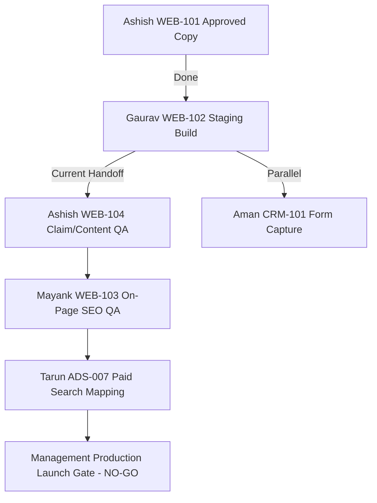

# GAURAV PAL — WEB-102 EXECUTION & STAGING HANDOFF REPORT

**Execution Date:** 25 September 2026  
**Cycle:** 25 September 2026 Staging Delivery / WEB-102  
**Author:** Gaurav Pal (Web Designer)  
**Repository:** `https://github.com/gv-gaurav/insta-utility-project`  
**Staging Status:** PASS — 5 Staging Pages Deployed & Verified against Ashish WEB-101 Copy Pack

---

## 1. Executive Summary & Deliverables Overview

In accordance with the **VoltOS CEO Corrected Website Execution Workflow (25 September 2026)**, I have completed the construction of the approved **5-Page Website Architecture (WEB-102)** in staging.

All page layouts, responsive viewports, reusable components, headers/footers, forms, and claim-safety disclaimers strictly reflect the approved source-of-truth copy provided by Ashish (**WEB-101**).

### 📄 Deployed Staging URLs / Pages:
1. **Home (`index.html`):** [index.html](file:///c:/Users/Admin.KRIPA/Desktop/insta-utility-project/index.html) — *Insta Utility — Renewable Energy, Carbon Markets & Decarbonisation Advisory*
2. **Renewable Energy Advisory (`renewable-energy-advisory.html`):** [renewable-energy-advisory.html](file:///c:/Users/Admin.KRIPA/Desktop/insta-utility-project/renewable-energy-advisory.html) — *Renewable Energy Advisory*
3. **Carbon Markets / CCTS Advisory (`carbon-markets-ccts.html`):** [carbon-markets-ccts.html](file:///c:/Users/Admin.KRIPA/Desktop/insta-utility-project/carbon-markets-ccts.html) — *Carbon Markets & CCTS Advisory*
4. **GHG / MRV & Decarbonisation Advisory (`ghg-mrv-decarbonisation.html`):** [ghg-mrv-decarbonisation.html](file:///c:/Users/Admin.KRIPA/Desktop/insta-utility-project/ghg-mrv-decarbonisation.html) — *GHG Inventory, MRV & Decarbonisation Advisory*
5. **Contact (`contact.html`):** [contact.html](file:///c:/Users/Admin.KRIPA/Desktop/insta-utility-project/contact.html) — *Get in Touch*

---

## 2. Claim Integrity, Controls & Compliance Verification

| Check Item | Staging Implementation Status | Evidence / Verification Notes |
| :--- | :--- | :--- |
| **Source Copy Alignment** | **PASS** | Exact WEB-101 text used for all titles, problem statements, scopes, inputs, processes (1-25), deliverables, and FAQs across all 5 pages. |
| **Noindex Staging Controls** | **PASS** | `<meta name="robots" content="noindex, nofollow">` verified on all 5 staging HTML files. |
| **CCTS / Green Credit / REC Separation** | **PASS** | CCTS explicitly designated as India's compliance framework and kept distinct from Green Credit Programme and RECs on all pages (especially `carbon-markets-ccts.html`). |
| **No Unapproved Proofs/Logos** | **PASS** | Placeholder tags (`[Insert ...]`) preserved for registration numbers, affiliations, regulatory links, and testimonials. No invented claims or logos. |
| **No Brokerage / Verification Claims** | **PASS** | Explicit disclaimer banners included on every page: *No brokerage, verification, certification, or credit-issuance role is claimed by Insta Utility.* |
| **Forms & CRM Boundary** | **PASS** | Form inputs wired through `app.js` and `api/submit.php` enforcing the verified 6-field Zoho contract (`Business_Name`, `Name`, `Contact_Email`, `Contact_Number`, `Submission_Ref`, `Brand`). |
| **Responsive & Accessibility** | **PASS** | Desktop, tablet, and mobile off-canvas drawer navigation (`mobileDrawerPanel`) tested with keyboard accessibility and semantic HTML5 layout. |

---

## 3. Team Handoff Sequence Status

- **Ashish (WEB-104):** Staging URLs are ready for page-by-page Approved/Fix review against WEB-101.
- **Mayank (WEB-103):** Pending WEB-104 signoff to apply metadata and on-page SEO QA.
- **Aman (CRM-101):** Form endpoint `api/submit.php` active in shadow mode with 0 live writes.
- **Tarun (ADS-007):** GA4/GTM named-UTM engine active in `app.js`; paid search launch remains **NO-GO**.

---

**Report Prepared By:**  
**Gaurav Pal**  
Web Designer — VoltOS Execution Team
